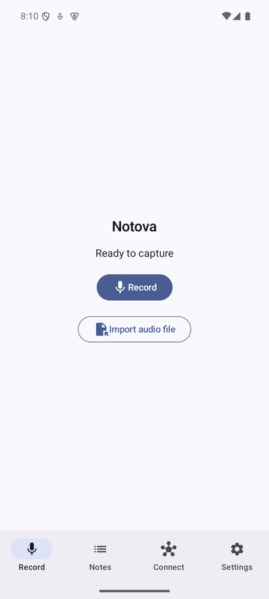
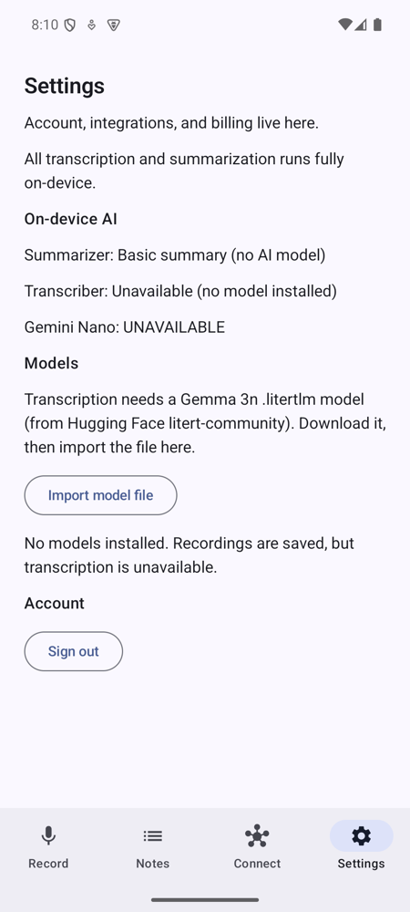
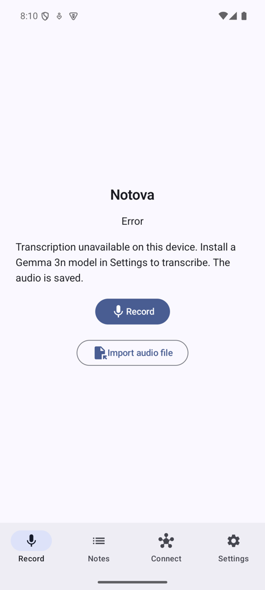

# Notova for Android

[](https://github.com/sandeepvijayarao09/notova-android/actions/workflows/android.yml)
[](LICENSE)

Record a meeting or voice memo, and Notova transcribes and summarizes it on the phone
with Gemma running locally. Kotlin, Jetpack Compose, nine Gradle modules.

<p>
  
  
  
</p>

<sub>Captured on an Android 15 emulator with no model installed. Notova keeps the audio
and says transcription is unavailable instead of inventing a transcript.</sub>

Part of Notova:
[notova-ios](https://github.com/sandeepvijayarao09/notova-ios) ·
[notova-backend](https://github.com/sandeepvijayarao09/notova-backend) ·
[roadmap](ROADMAP.md)

## Highlights

- **On-device engines, picked at call time.** `ResolvingTranscriber` and
  `ResolvingSummarizer` try engines in priority order and report the active one in
  Settings.

  | Stage | Engine chain |
  | --- | --- |
  | Transcription | Gemma 3n audio via LiteRT-LM (16 kHz mono PCM, 30 s windows). No fake fallback. |
  | Summaries | Local Gemma via LiteRT-LM → Gemini Nano (ML Kit GenAI, AICore devices) → basic extract labelled "no AI model" |

  One imported Gemma 3n `.litertlm` file powers both transcription and summaries.
- **Background-safe capture**: a foreground recording service, Bluetooth SCO routing,
  file import through the Storage Access Framework, and WorkManager processing for long
  imports.
- **Hilt, Room, DataStore, Retrofit, WorkManager**; ktlint, detekt, Android Lint and an R8
  release build in CI.
- **356 JVM unit and Robolectric tests**, all run in CI on every push.

## Try it

The [v1.0.0 release](https://github.com/sandeepvijayarao09/notova-android/releases/tag/v1.0.0)
has test-signed APKs (`arm64-v8a` for phones, `x86_64` for emulators). They predate the
honest-fallback change below, so build from `main` for the current behavior.

To transcribe, download a Gemma 3n LiteRT-LM model (for example
`gemma-3n-E2B-it-int4.litertlm` from the `litert-community` org on Hugging Face; you must
accept Gemma's license there), then use **Settings → Import model file**. Without a model,
recordings are saved and marked as not transcribed. `SpeechRecognizer` is in the chain but
reports itself unavailable: feeding it a recorded file is not wired yet.

## Build

JDK 17 is required; newer JDKs break this AGP/Kotlin combination.

```bash
git clone https://github.com/sandeepvijayarao09/notova-android.git
cd notova-android
echo "sdk.dir=$HOME/Library/Android/sdk" > local.properties   # your SDK path

export JAVA_HOME=/path/to/jdk-17
./gradlew :app:assembleDebug          # APKs in app/build/outputs/apk/debug/
./gradlew testDebugUnitTest           # unit + Robolectric tests
./gradlew ktlintCheck detekt lint     # static analysis
```

### Accounts and export (optional)

Sign-in, sync and export go through [notova-backend](https://github.com/sandeepvijayarao09/notova-backend),
which has no public deployment. The default backend URL is `http://10.0.2.2:8787/`, i.e.
a local `npm run dev` server seen from the emulator; cleartext HTTP is allowed only for
that host and localhost. Build against another deployment with
`./gradlew assembleDebug -Pnotova.backendUrl=https://your-host/`. Providers match the
backend: Notion export works; Google, Slack and Salesforce connect but the backend
returns 501 for export.

## Modules

| Module | Responsibility |
| --- | --- |
| `:app` | `NotovaApp`, `MainActivity` (Record / Notes / Connect / Settings), `ProcessRecordingWorker`, recording service |
| `:core` | Domain models, pipeline interfaces, `PipelineUseCase`, the basic extractive summarizer |
| `:ai` | Gemma via LiteRT-LM (transcription and summaries), Gemini Nano, `SpeechRecognizer` engine, resolvers, `ModelStore` / `ModelDownloader` |
| `:data` | Room database, `RecordingRepository`, DataStore |
| `:design` | Compose theme and shared components |
| `:integrations` | Retrofit client for the backend `/v1` API, auth/token storage, export |
| `:feature:record` | Record screen and `MediaRecorderAudioSource` |
| `:feature:notes` | Notes list and detail |

Toolchain: AGP 8.7.3, Kotlin 2.0.21, Gradle 8.13, compileSdk/targetSdk 35, minSdk 26.

## License

Apache-2.0. See [LICENSE](LICENSE) and [NOTICE](NOTICE). Models carry their own licenses
and are not bundled.
